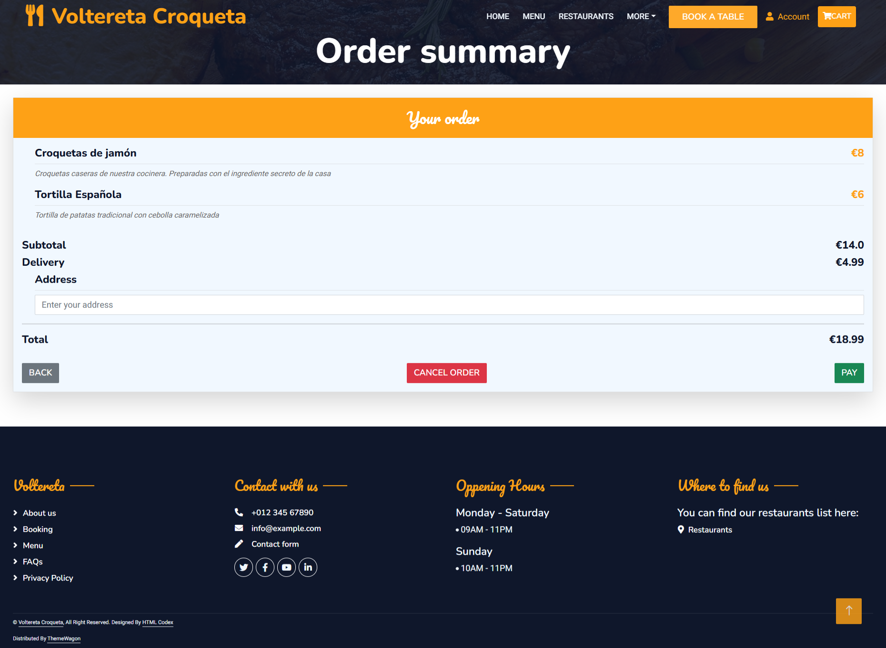
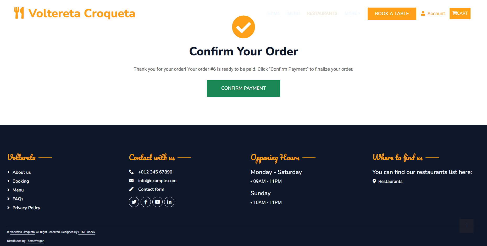
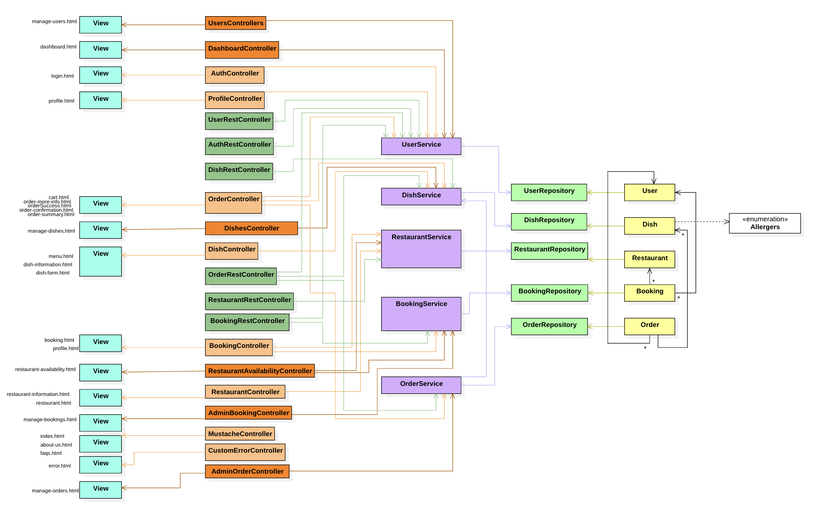

# Voltereta Croqueta
___
## Index
- [**Phase 0**](#phase-0)
    - [**:busts_in_silhouette: Development team member**](#busts_in_silhouette-development-team-members)
    - [**:hammer_and_wrench: Team coordination tool**](#hammer_and_wrench-team-coordination-tool)
    - [**:memo: Entities**](#memo-entities)
    - [**:gear: Functionalities**](#gear-functionalities)
    - [**:key: User permissions**](#key-user-permissions)
    - [**:framed_picture: Images**](#framed_picture-Images)
    - [**:bar_chart: Graphics**](#bar_chart-Graphics)
    - [**:bulb: Complementary technology**](#bulb-complementary-technology)
    - [**:chart_with_upwards_trend: Algorithm and advanced query**](#chart_with_upwards_trend-algorithm-and-advanced-query)
- [**Phase 1**](#phase-1)
  - [**:computer: Screens**](#computer-Screens) 
      - [**Home-page**](#Home-page)
      - [**Register/Login**](#Register-Login)
      - [**About-us**](#About-us)
      - [**Admin-actions-confirmed**](#Admin-actions-confirmed)
      - [**Booking**](#Booking)
      - [**Dish-information**](#Dish-information)
      - [**Edit-dish**](#Edit-dish)
      - [**Edit-profile**](#Edit-profile)
      - [**Error**](#Error)
      - [**Faqs**](#Faqs)
      - [**Menu**](#Menu)
      - [**New-dish**](#New-dish)
      - [**Order-confirmation-screen**](#Order-confirmation-screen)
      - [**Order-manager**](#Order-manager)
      - [**Order-summary**](#Order-summary)
      - [**Order-summary-admin**](#Order-summary-admin)
      - [**Orders-list**](#Orders-list)
      - [**Pickup-delivery-order**](#Pickup-delivery-order)
      - [**Profile**](#Profile)
      - [**Rate-order**](#Rate-order)
      - [**Ban-message**](#Ban-message)
      - [**Manage-user**](#Manage-user)
      - [**Restaurant-availability**](#Restaurant-availability)
      - [**Restaurant-information**](#Restaurant-information)
      - [**Restaurants**](#Restaurants)
  - [**:diamonds:Flow Diagram**](#diamonds-Flow-Diagram)
  - [**Phase 2**](#phase-2)
    - [**:computer: New Screens**](#computer-New-Screens)
    - [**:diamonds: New Flow Diagram**](#diamonds-New-Flow-Diagram)
    - [**:rocket: Execution Instructions**](#rocket-Execution-Instructions)
    - [**:file_folder:Diagram with the database entities**](#file_folder-Diagram-with-the-database-entities)
    - [**:art:Class diagram and templates**](#art-Class-diagram-and-templates)
    - [**:raised_hand: Participation**](#raised_hand-Participation)
  - [**Phase 3**](#phase-3)
    - [**:globe_with_meridians:API REST documentation**](#globe_with_meridians-API-REST-documentation)
    - [**:art:Class diagram and templates 2**](#art-Class-diagram-and-templates-2)
    - [**:feet:Instructions for Running the Dockerized Application**](#feet-Instructions-for-Running-the-Dockerized-Application)
    - [**:paperclip: Documentation for Building the Docker Image**](#paperclip-Documentation-for-Building-the-Docker-Image)
    - [**:dash: Deployment on Virtual Machine**](#dash-Deployment-on-Virtual-Machine)
    - [**:dash: Deployed application URL**](#dash-Deployed-application-URL)
    - [**:bust_in_silhouette: User Examples**](#bust_in_silhouette-User-Examples)
    - [**:raised_hand: Participation**](#raised_hand-Participation-phase-3)
  - [**Phase 4**](#phase-4)
    - [**:globe_with_meridians: SPA Client with Angular documentation**](#globe_with_meridians-SPA-Client-with-Angular-documentation)
    - [**:art: Class and templates diagram of SPA**](#art-Class-and-templates-diagram-of-SPA)
    - [**:raised_hand: Participation phase 4**](#raised_hand-Participation-phase-4)
    - [**:video_camera: Video of the application**](#video_camera-Demo-video)
___

# Phase 0
___
## :busts_in_silhouette: Development team members

| Name and surname         | mail                              | github        |
|--------------------------|-----------------------------------|---------------|
| Nicolás Hernández Tejero | n.hernandezt.2021@alumnos.urjc.es | nicohht       |
| Hugo Sánchez Torres      | h.sanchez.2021@alumnos.urjc.es    | stHugo010     |
| Juan Ramírez Blanco      | j.ramirez.2021@alumnos.urjc.es    | juanramirezbl |
| Jesús López Esquinas     | j.lopeze.2020@alumnos.urjc.es     | jesuslpzZz    |
| Víctor Muñoz Regalón     | v.munozr.2020@alumnos.urjc.es     | victoor-78    |

___

## :hammer_and_wrench: Team coordination tool
### Trello
This tool offers a Kanban-like organization, allowing us to view at any time and from any location the section of the software that is under development, completed, or pending.
<a href="https://trello.com/b/k80Jt9Pc/daw-wabapp07">Trello link</a>

___
## Main aspects of the web application
___
### :memo: Entities
The main entities that the application will manage are:
- Users
- Orders
- Dishes
- Promotions
- Reviews
- Restaurants
- Reservations

:twisted_rightwards_arrows: <b>Main relations between entities: </b>
Users can be anonymous users, admins, or customers.
Customers can place orders with one or more dishes and rate each dish apart from make reservations at one of the restaurants.
Admins can add dishes to the menu.
Orders contain the dishes, the price, the user information and delivery address.
Restaurants contain dishes, reservations, reviews and promotions. 
Dishes contain the promotions about them.

___
### :gear: Functionalities
- Register/Login system for accounts
- Modify account information
- View the restaurant information
- View the menu dishes
- Search with filters
- Book a restaurant table
- Place an order for take-away or delivery
- Check order history
- Rate the dishes
- Download the digital receipt as a PDF file
- Send notifications about orders
- Modify and manage the orders, reservations, menu and products
- Manage user accounts
- Consult graphs about orders
___

### :key: User permissions
The permissions of each of the user types are:
- <b>Anonymous</b>: View the menu and dishes, search for dishes, view promotions, reserve a table at the restaurant, check out news and updates, about us section, view the restaurant's location.
- <b>Registered</b>: Order for delivery, rate orders, access order history, view public ratings for each dish and your own ratings for each dish.
- <b>Admin</b>: All the permissions of a registered user, remove dishes from the menu, modify dishes, modify reservations, add new dishes to menu, block users, unblock users, cancel orders, view the graphs with order statistics.
___
### :framed_picture: Images
The images mentioned are related to the entities mentioned above.
- Favicon of the web page.
- Dish Photos.
- Stands Image (Restaurant).
- Restaurant logo.
___
### :bar_chart: Graphics
The information that will be displayed using graphics is:
- Average orders per hour: Table
- Top 10 best-selling dishes with the number of orders on that day: Table
- The 15 best-rated dishes along with their number of ratings: Table

___
### :bulb: Complementary technology
The complementary technology to be used is:
- Our application allows users to generate a PDF receipt for their orders.
- Our application calculates the estimated delivery time based on the restaurant's address and the delivery address provided by the customer.


___

### :chart_with_upwards_trend: Algorithm and advanced query
The algorithm or advanced query to be implemented is:
- Automatic classification when submitting the match report.
- Advanced statistics of  matches by team/player.
- Search bar on teams and players pages.
___

___
# Phase 1
___
#  :computer: Screens
___

## Home-page:
Voltereta Croqueta's home screen features a welcoming interface with navigation options. It highlights the restaurant's main features, such as expert chefs, quality food, online ordering and 24/7 service. It also includes a welcome section describing the restaurant's experience and history, along with information about years of experience and popular chefs.


___
## Register-Login:
The login screen for Voltereta Croqueta provides a simple and user-friendly interface for users to access their accounts. It features fields for entering a username and password, along with a "LOGIN" button to submit the credentials. Additionally, there are options to sign up for new users who do not yet have an account.


___

## About-us:
This screen provides detailed information about Voltereta Croqueta, highlighting its culinary philosophy and commitment to fresh ingredients and authentic recipes. It includes a brief history of the restaurant and a list of the master chefs, each specializing in different types of cuisine.


___

## Admin-actions-confirmed:
This screen confirms that an operation (such as a reservation or order) has been successfully completed. It displays a clear confirmation message and a button to return to the home page.


___

## Booking:
This screen allows users to book a table at Voltereta Croqueta. It includes options to choose a restaurant, specify the number of people, select the date and time, and provide reservation details such as name, last name, email, and phone number. A "CONFIRM ORDER" button finalizes the reservation.


___

## Booking-confirmation:
This screen confirms that a user's reservation has been successfully placed. It provides a thank-you message and informs the user that they will receive a confirmation email shortly. A "BACK TO HOME" button allows users to return to the main page.


___

## Dish-information:
This screen provides detailed information about a specific dish. It includes the dish's description, price, ingredients, and allergen information. Additional notes remind users to inform the restaurant of any dietary restrictions. Options to edit the dish, mark it as unavailable, or delete it are available for management purposes.


___

## Edit-dish:
This screen allows for the editing of dish details, such as the name, description, price, and ingredients. It also includes a comprehensive list of allergens and dietary preferences, such as vegan options. A "SAVE CHANGES" button is provided to update the dish information.


___

## Edit-profile:
This screen allows users to view and edit their profile information. It includes fields for name, email, phone number, and address. Users can save changes or cancel the edits. The interface is straightforward, with clear options for updating personal details.


___

## Error:
This screen is displayed when a user tries to access a page that does not exist. It features a clear message indicating that the page is not found and provides options to return to the homepage or contact support for further assistance. The design is simple and user-friendly, ensuring users can easily navigate back to the main site.


___

## Faqs:
This screen provides answers to frequently asked questions about the restaurant, including reservations, menu options, allergens, and more. It also includes a section for customer testimonials, highlighting positive experiences from various patrons. The interface is informative and well-organized, making it easy for users to find the information they need. Contact details and opening hours are also provided for quick reference.


___

## Menu:
This screen displays the food menu of Voltereta Croqueta, allowing users to search for their favorite dishes. It features a variety of dishes categorized by type, such as breakfast and dinner, with brief descriptions for each. A "VIEW MORE" option suggests additional dishes are available.


___

## New-dish:
This screen allows administrators to add a new dish to the menu. It includes fields for the dish name, description, price, and ingredients. There are also options to select allergens and dietary preferences, such as vegan options. An upload feature for dish images is included. The "ADD DISH" button finalizes the addition.


___

## Order-confirmation:
This screen confirms that a user's order has been successfully placed. It provides a thank-you message and informs the user that they will receive a confirmation email shortly. A "VIEW LAST ORDERS" button allows users to check their orders list.


___

## Order-manager:
This screen allows administrators to manage restaurant orders. It displays a list of current orders with details such as order number, date, total amount, and ordered items. Each order includes options to view more details, cancel, or accept the order. A progress tracker shows the number of active orders and the order limit. The interface is designed for easy order monitoring and management.


___

## Order-summary:
This screen provides users with a detailed summary of their order before proceeding to payment. It displays the list of ordered items, their quantities, individual prices, and the total cost, including delivery fees. The selected delivery address is also shown. Users have the option to go back, cancel the order, or proceed to payment. The interface ensures clarity and ease of navigation for a smooth checkout experience.


___

## Order-summary-admin:
This screen is designed for restaurant administrators to review and manage customer orders. It displays a detailed summary of each order, including the order number, list of purchased items with their quantities, individual prices, and the total cost, including delivery fees. Additionally, it provides customer information, such as name and delivery address, as well as the restaurant location associated with the order.

Admins can also see whether the order is for pickup or delivery, with an option to modify this selection. A "Back" button allows them to return to the order management interface. The layout ensures clarity and ease of navigation, helping staff efficiently process and verify orders.


___

## Orders-list:
This screen allows customers to view their past orders. It displays order details, including the date, order number, and total price. Each order card lists the ordered items, their quantities, and individual prices. Customers can access additional options, such as viewing more details, downloading the receipt, reordering, or rating their experience.


___

## Pickup-delivery-order:
This screen allows customers to choose between pickup and delivery options for their orders. Users can select their preferred order type and fill out the necessary details, such as location, name, and time for pickup or address and contact information for delivery. A simple interface ensures an easy and efficient ordering process, with a "Confirm" button to finalize the selection.


___

## Profile:
This screen displays the user profile information for Voltereta Croqueta. It includes essential details such as name, email, phone number, and address, allowing users to review their personal data. The interface offers quick access to actions like editing the profile, viewing past orders, or returning to the homepage. A clean layout ensures easy navigation for managing account details.


___

## Rate-order:
This screen allows users to view and rate their past orders. It includes details like the order number, date, and the dish's name with a description and price. Users can provide feedback by rating their dish with a star-based system and submitting their review. A "Back to Order" button ensures easy navigation to previous orders. The clean and structured layout ensures a user-friendly experience.


___
## Ban-message:
This screen displays a notification to the user, JohnDoe123, informing them that their account has been suspended due to violations of the platform's terms of service. The message is clear and direct, providing the user with the option to contact the support team if they believe the suspension is a mistake. The "CONTACT SUPPORT" button is prominently displayed, guiding the user on the next steps to resolve the issue.


___

## Manage-user:
The User Management screen provides administrators with a comprehensive overview of all registered users on the Voltereta Croqueta. It features a search bar for quick user lookup and a table displaying user details, including ID, Username, Email, Status (Active or Banned), and Actions (represented by icons for managing user accounts). The interface is designed for efficiency, allowing admins to easily monitor and manage user statuses and perform necessary actions such as banning or unbanning users.


___

## Restaurant-availability:
This screen provides an overview of the reservation status for different restaurants of Voltereta Croqueta. It includes a table that lists the restaurant, date, total reservations, available seats, and the current status (Available or Full). Each entry also has an option to "View Details" for more information. The interface is designed to help restaurant staff quickly assess availability and manage reservations efficiently.


___

## Restaurant-information:
This screen provides essential details about Voltereta Móstoles, including its address, contact information, and opening hours. Users can explore available services such as accessibility, WiFi, and delivery. The page also features booking and ordering options, along with images of the restaurant and its location on Google Maps.


___

## Restaurants:
This screen allows users to explore the various locations of Voltereta Croqueta. It features a search bar for finding nearby restaurants and a "Use My Location" button for convenience. Users can view popular restaurants through images and interact with an embedded Google Maps preview for easy navigation.


___
# :diamonds: Flow Diagram:

The diagram is a flow chart showing user permissions and navigation steps within a web interface. The diagram uses colored arrows to indicate the progression from one web page or state to another, based on user actions or permissions.

- The diagram is a complex schematic with multiple screenshots of web pages connected by colored arrows indicating different user actions or states.
- Each screenshot represents different sections or pages of a restaurant website.
- There is an initial state at the top: "Index", leading to different paths depending on the user's status.
- Arrows connect these initial state to various web pages, including "Menu", "Restaurants", "Profile" and diferent admin workflow pages, among others.
- Each colored arrow represents a user, and therefore the path through which he/she can navigate the site.
- Red arrows represent Admin functions, the green ones are for Registered User and the blue arrows are for every user. 


___
# Phase 2
___
#  :computer: New Screens
## Menu:
This image shows the menu page of "Voltereta Croqueta". Users can browse a list of available dishes, each displayed with an image, description, price, and rating. Each dish has options to add to cart or view more details. There are also buttons to filter dishes, load more dishes, and add a new dish if the user has admin permissions.


___
## Booking management:
This image shows the Booking Management Panel for Voltereta Croqueta, where admins can view and manage reservations. It includes a search bar, a reservation list with details (user, restaurant, shift, people, and date), and a delete button for easy management.


___

## Dish management:
This image displays the Dish Management Panel for Voltereta Croqueta, where admins can manage the restaurant's menu. It includes a search bar, a list of dishes with their prices, and edit/delete buttons for easy modifications.


___
## User management:
This image showcases the User Management Panel for Voltereta Croqueta, allowing admins to manage user accounts. It includes a search bar, a list of users with emails and statuses, and ban/unban buttons for controlling access.


___
## Admin Dish Info:
This screen displays detailed information about a specific dish, including its name, description, price, ingredients, and allergens. Admins can edit, mark as unavailable, or delete the dish.


___
## Admin Edit Dish:
This image showcases the interface for editing dish details. Admins can modify the dish name, description, price, ingredients, and allergens before saving changes.


___
## Admin New Dish:
This screen provides a form for adding a new dish to the menu. Admins can input dish details, select allergens, dietary preferences, and upload an image.


___
## Booking:
This screen presents the reservation form, enabling users to select a restaurant, date, shift, and number of people, while providing personal details to confirm the booking.


___
## Existing Reservation:
This image shows the notification for users who already have an active reservation, preventing duplicate bookings and directing them to manage their reservation in the profile section.


___
## Booking Cancelled:
This confirmation screen informs users that their reservation has been successfully cancelled, offering a direct link to rebook a table.


___
## Profile:
This screen displays user profile details, including personal information and an active reservation summary, with the option to cancel the booking directly from the page.


___
## Restaurants:
This page lists available restaurant locations, providing images and addresses, along with a search bar to filter by city or postal code.


___
## Order Summary:
This image shows the Order Summary page of "Voltereta Croqueta". It displays the items in the user's order, including the dish name, description, and price. Below, it calculates the subtotal, delivery fee, and the total cost. There is a field to enter the delivery address and buttons to go back, cancel the order, or proceed with payment. The footer contains contact details, opening hours, and restaurant locations.


___
## Order Confirm:
This image shows the Order Confirmation page of "Voltereta Croqueta". It thanks the user for their order and informs them that Order #6 is ready for payment. A "Confirm Payment" button allows the user to finalize the transaction. The footer contains links to company information, contact details, opening hours, and restaurant locations.


___
## Order History:
The "Order History" page of Voltereta Croqueta allows users to review their past purchases, including order details, total cost, and item descriptions, providing a clear record of their dining history.


___
## Order Managment:
The "Order Management" page of Voltereta Croqueta provides administrators with a centralized interface to track, update, and manage customer orders, including status changes, price details, and user information.


___
## Payment successful:
This image shows the Payment Successful page of "Voltereta Croqueta". It confirms that Order #6 has been successfully paid and thanks the user for their payment. A "Back to Orders" button allows the user to return to their order history. The footer contains company information, contact details, opening hours, and restaurant locations.


___
## Admin Dashboard:
This panel serves as the main admin interface, allowing access to various management functionalities such as user administration, dish control, and booking supervision.


___
## Confirm Action Popup
This modal appears when performing critical actions, such as deleting a reservation, requiring users to confirm before proceeding.

___
# :diamonds: New Flow Diagram:

The diagram is a flow chart showing user permissions and navigation steps within a web interface. The diagram uses colored arrows to indicate the progression from one web page or state to another, based on user actions or permissions.


# :rocket: Execution Instructions

##  Steps
1. **Download the Repository**


2. **Check Requirements:**
- Java JDK 19
- MySQL v.8.0.36.0
- Maven 4.0.0
- Spring Boot v3.4.2
- Integrated Development Environment (IDE) - IntelliJ IDEA recommended

3. **Configure Database:**
- Download MySQL v.8.0.36.0
- Select default port (port 3306)
- Create a user with name root "root" and password "webapp07" with DB admin as user role
- Configure MySQL Server as Windows Service
- Grant full access to the user

4. **Docker Configuration:**
- Download Docker desktop.
- Execute in terminal:
  - docker run -d --name volteretaCroquetaBD -p 3306:3306 -e MYSQL_ROOT_PASSWORD=webapp07 -e MYSQL_DATABASE=volteretaCroqueta mysql:latest
  - docker exec -it volteretaCroquetaBD bash

5. **Configure IDE:**
- Install IntelliJ IDEA (or your preferred IDE).
- Install Maven and Spring plugins for your IDE.

6. **Run Application in the IDE:**
- Open the project in your IDE.
- Build the project using Maven.
- Run the application.

7. **Access the Application:**
- Visit https://localhost:8443 in your web browser.

--- 
# :file_folder: Diagram with the database entities

Next, a diagram will be included depicting the entities within the database, their respective fields, and the relationships among them.


# :art: Class diagram and templates

---
# :raised_hand: Participation

---


#### Nicolás Hernández Tejero

*  Implemented error handling across the application to improve reliability.
*  Added Javadocs for better code documentation and maintainability.
*  Developed reusable Navbar, Header, and Footer components for consistent UI.
*  Created Admin Panel to manage users and dishes efficiently.
*  Designed a confirmation modal for critical user actions.
*  Implemented show and edit profile functionality.
*  Added ban/unban functionality for user management.
*  Secured authentication for all views, ensuring restricted access based on roles.
*  Developed login and registration functionality for new users.
*  Strengthened security in the login process to prevent unauthorized access.
*  PDF generation

| #   |                                                                                    Commit                                                                                     |     | #   |                                                                                                             File                                                                                                              |
| :-: |:-----------------------------------------------------------------------------------------------------------------------------------------------------------------------------:| :-: | :-: |:-----------------------------------------------------------------------------------------------------------------------------------------------------------------------------------------------------------------------------:|
| 1º  |                      [fix: login spring boot problem](https://github.com/CodeURJC-DAW-2024-25/webapp07/commit/0ceeb4baf48c277fec7645962143363d2c6e0297)                       | | 1º |                               [ProfileController.java](https://github.com/CodeURJC-DAW-2024-25/webapp07/blob/main/backend/src/main/java/es/codeurjc/backend/controller/ProfileController.java)                                |
| 2º  |        [refactor: unify profile view and edit into single template](https://github.com/CodeURJC-DAW-2024-25/webapp07/commit/1ca74809847b20f93aaea0746d5f323fd77239b4)         | |2º |                                  [AuthController.java](https://github.com/CodeURJC-DAW-2024-25/webapp07/blob/main/backend/src/main/java/es/codeurjc/backend/controller/AuthController.java)                                   |
| 3º  |           [feat: add authentication interceptor and admin panel](https://github.com/CodeURJC-DAW-2024-25/webapp07/commit/a686f202d534e96e771427b98d2a7982190a0ca7)            | | 3º |                                 [AuthInterceptor.java](https://github.com/CodeURJC-DAW-2024-25/webapp07/blob/main/backend/src/main/java/es/codeurjc/backend/interceptor/AuthInterceptor.java)                                 |
| 4º  |          [feat(admin): Add ban and unban functionality for users](https://github.com/CodeURJC-DAW-2024-25/webapp07/commit/58c1220ee0c621537c56745e2500d2ef526d8153)           | | 4º |               [CustomAuthenticationFailureHandler.java](https://github.com/CodeURJC-DAW-2024-25/webapp07/blob/main/backend/src/main/java/es/codeurjc/backend/security/CustomAuthenticationFailureHandler.java)                |
| 5º  |                   [feat: add reusable confirmation modal](https://github.com/CodeURJC-DAW-2024-25/webapp07/commit/f2a56d57152ea931495cdb001b4f8dce7a57ac29)                   | | 5º |                                   [UserService.java](https://github.com/CodeURJC-DAW-2024-25/webapp07/blob/main/backend/src/main/java/es/codeurjc/backend/service/UserService.java)                                   |

  #### Víctor Muñoz Regalón

*  Developed the **booking system** for users, allowing them to make, view, and cancel reservations.
*  Ensured that users can only have one **active reservation** at a time to prevent duplicate bookings.
*  Implemented **real-time availability checks** for restaurant reservations based on date, shift, and capacity.
*  Created the **booking confirmation** and **cancellation views**, improving user experience.
*  Developed the **admin panel for booking management**, allowing administrators to view and delete the active reservations.
*  Integrated **AJAX-based** dynamic seat availability updates when users select a restaurant and shift, allowing real-time updates without reloading the page.
*  Implemented **flash messages** for errors and confirmations in booking actions.
*  Developed the **profile page integration** to display the user’s current reservation with a cancel button.
*  Designed and implemented the **database structure for bookings**, linking users and restaurants.
*  Ensured that users can only make reservations for **available seats** to prevent overbooking.


| #   |                                                                                   Commit                                                                                    |     | #   |                                                                                       File                                                                                       |
| :-: |:---------------------------------------------------------------------------------------------------------------------------------------------------------------------------:| :-: | :-: |:--------------------------------------------------------------------------------------------------------------------------------------------------------------------------------:|
| 1º  |                          [Update: Booking.java](https://github.com/CodeURJC-DAW-2024-25/webapp07/commit/08e53c5923bbea164a9f8a31493fe47e90a3e925)                           | | 1º |                     [Booking.java](https://github.com/CodeURJC-DAW-2024-25/webapp07/blob/main/backend/src/main/java/es/codeurjc/backend/model/Booking.java)                      |
| 2º  |                         [Add: BookingController](https://github.com/CodeURJC-DAW-2024-25/webapp07/commit/5815625ddf1b64f270058b67f1ff7e89034ccb4b)                          | |2º |         [BookingController.java](https://github.com/CodeURJC-DAW-2024-25/webapp07/blob/main/backend/src/main/java/es/codeurjc/backend/controller/BookingController.java)         |
| 3º  |                           [Add: BookingService](https://github.com/CodeURJC-DAW-2024-25/webapp07/commit/067a2e4ea70f90dffe4df3ff75e97248984cee65)                           | | 3º |             [BookingService.java](https://github.com/CodeURJC-DAW-2024-25/webapp07/blob/main/backend/src/main/java/es/codeurjc/backend/service/BookingService.java)              |
| 4º  |           [Update booking.html: Add Javascript available seats](https://github.com/CodeURJC-DAW-2024-25/webapp07/commit/71d3945bea29478148564cbba9eac86b47baeedc)           | | 4º |                           [Booking.html](https://github.com/CodeURJC-DAW-2024-25/webapp07/blob/main/backend/src/main/resources/templates/booking.html)                           |
| 5º  | [Fixed: Admin Booking Search functionality by username, email, and phone](https://github.com/CodeURJC-DAW-2024-25/webapp07/commit/4d80d09c119f28126f7c9bef1caba427fd2074e1) | | 5º | [AdminBookingController.java](https://github.com/CodeURJC-DAW-2024-25/webapp07/blob/main/backend/src/main/java/es/codeurjc/backend/controller/admin/AdminBookingController.java) |

#### Hugo Sánchez Torres

*  Developed the application's **dish menu**.
*  Implemented dynamic data loading based on **AJAX**, taking filter values into account.
*  Developed the functionality to **edit**, **add**, and **delete** dishes.
*  Implemented a **filter fragment** for the application's menu.
*  Developed a **filter** for the dish menu, with the ability to filter by **name**, by an **ingredient**, or by **maximum price**.
*  Mark **dishes as disabled**.
*  Added **image implementation** using Blob.


| #   |                                                              Commit                                                               |     | #   |                                                                            File                                                                            |
| :-: |:---------------------------------------------------------------------------------------------------------------------------------:| :-: | :-: |:----------------------------------------------------------------------------------------------------------------------------------------------------------:|
| 1º  |        [Fix: Menu's Ajax](https://github.com/CodeURJC-DAW-2024-25/webapp07/commit/111fd36026297d408610741d3eeefc7ab3dfbf6a)        | | 1º |                   [dishes.js](https://github.com/CodeURJC-DAW-2024-25/webapp07/blob/main/backend/src/main/resources/static/js/dishes.js)                   |
| 2º  |    [Fix: Add and edit dishes](https://github.com/CodeURJC-DAW-2024-25/webapp07/commit/d9e3df83d2eabe4f2987fade0d8bebde66bfe63d)     | |2º | [DishController.java](https://github.com/CodeURJC-DAW-2024-25/webapp07/blob/main/backend/src/main/java/es/codeurjc/backend/controller/DishController.java) |
| 3º  |      [Update: Filter done](https://github.com/CodeURJC-DAW-2024-25/webapp07/commit/25236b83f1a2d05165be799cdb5f7f22afeebadb)      | | 3º | [DishController.java](https://github.com/CodeURJC-DAW-2024-25/webapp07/blob/main/backend/src/main/java/es/codeurjc/backend/controller/DishController.java) |
| 4º  |      [Update: can add dish to cart at ajax script](https://github.com/CodeURJC-DAW-2024-25/webapp07/commit/d372ae74771132b8229c6ae4ca9578c0207842e2)      | | 4º |                                                                       [dishes.js](https://github.com/CodeURJC-DAW-2024-25/webapp07/blob/main/backend/src/main/resources/static/js/dishes.js)                                                                        |
| 5º  | [Update: Dish rates](https://github.com/CodeURJC-DAW-2024-25/webapp07/commit/213b71e6f6c8cd462cdfcc412b66c5b87d29b7c2) | | 5º | [DishController.java](https://github.com/CodeURJC-DAW-2024-25/webapp07/blob/main/backend/src/main/java/es/codeurjc/backend/controller/DishController.java) |


# Juan Ramírez Blanco

- **Order System Architecture**: Developed a structured and scalable approach for managing orders.
- **Order Summary Screen**: Created a detailed breakdown of the user's order before payment.
- **Add to Cart Button**: Helped implement functionality allowing users to dynamically add items to their cart.
- **Pay Button**: Implemented secure payment processing functionality.
- **Order Confirmation & Success Screens**: Designed and developed screens to enhance the user experience after a purchase.
- **View Orders Button**: Enabled users to access their order history.
- **Order History Section**: Created a comprehensive list of paid orders.
- **Order Admin Structure**: Created the structure to efficiently manage and oversee orders.
- **Modify Order & Delete Order Buttons**: Developed functionality for administrators to update or remove orders as needed.
- **Class Diagram & Templates**: Developed structured foundations for order management and UI consistency.


| #   |                                                              Commit                                                               |     | #   |                                                                                       File                                                                                       |
| :-: |:---------------------------------------------------------------------------------------------------------------------------------:| :-: | :-: |:--------------------------------------------------------------------------------------------------------------------------------------------------------------------------------:|
| 1º  |        [Add: Order Admin List.java](https://github.com/CodeURJC-DAW-2024-25/webapp07/commit/5b9a7283492a51205e0d29c8bfff1933f81a36c0)        | | 1º |                       [AdminController.java](backend/src/main/java/es/codeurjc/backend/controller/admin/AdminOrderController.java)                       |
| 2º  |    [Add: Add to Cart Button](https://github.com/CodeURJC-DAW-2024-25/webapp07/commit/8fafbd621aa924abb45f0488d89161a4e0d5e441)     | |2º |         [cart.js](backend/src/main/resources/static/js/cart.js)         |
| 3º  |      [Add: Delete order as Admin](https://github.com/CodeURJC-DAW-2024-25/webapp07/commit/870e86495948e0ee9fa24915fa667d7c8f96b4c5)      | | 3º |             [AdminOrderController.java](backend/src/main/java/es/codeurjc/backend/controller/admin/AdminOrderController.java)              |
| 4º  |      [Add: Edit Order as Admin](https://github.com/CodeURJC-DAW-2024-25/webapp07/commit/2739e781cd88f934494391a0299913992ee7ac31)      | | 4º |                           [AdminOrderController.java](backend/src/main/java/es/codeurjc/backend/controller/admin/AdminOrderController.java)|
| 5º  | [Add: Order summary pay button and confirm page](https://github.com/CodeURJC-DAW-2024-25/webapp07/commit/13fd26bae5554d4e254992baaa8c09c7766d5e58) | | 5º | [OrderController.java](backend/src/main/java/es/codeurjc/backend/controller/OrderController.java) |

#### Jesús López Esquinas

* Constantly reviewed the application's status across all its sections.
* Fixed various types of issues throughout the application (styling, naming, links & functions).
* Added the HTTPS protocol with its respective certificate.
* Implemented the anti-CSRF verification system and introduced token renewal in all necessary places.
* Fixed the CustomErrorController system.
* Added differentiation between different types of errors (this change is reflected on the error page).
* Improved web security for proper flow and permission handling.
* Implemented the Restaurant Availability system (both page and controller).
* Added RestaurantController
* Redesigned the restaurant page and added a search system.
* Created the administrator Dashboard system, which includes the chart and future charts to be developed.
* Enhanced user data privacy by preventing others from accessing confidential information.
* Fixed the GET and POST system for all Order-related methods to ensure proper functionality.


| #  |                                                                     Commit                                                                     |     | #   |                                                                                              File                                                                                               |
|:--:|:----------------------------------------------------------------------------------------------------------------------------------------------:| :-: | :-: |:-----------------------------------------------------------------------------------------------------------------------------------------------------------------------------------------------:|
| 1º |        [Update: User Orders Privacy](https://github.com/CodeURJC-DAW-2024-25/webapp07/commit/0ac0319842995b913ca48f7de54a9bc66182ae4a)         | | 5º |                  [OrderController.java](https://github.com/CodeURJC-DAW-2024-25/webapp07/blob/main/backend/src/main/java/es/codeurjc/backend/controller/OrderController.java)                   |
| 2º |       [Add: Dashboard page and logic](https://github.com/CodeURJC-DAW-2024-25/webapp07/commit/d398d23a916d417556f4676ef194ccb54fea0c61)        | | 1º |           [DashboardController.java](https://github.com/CodeURJC-DAW-2024-25/webapp07/blob/main/backend/src/main/java/es/codeurjc/backend/controller/admin/DashboardController.java)            |
| 3º |       [Update: CustomErrorController](https://github.com/CodeURJC-DAW-2024-25/webapp07/commit/64354bdf7d231bad0f47fd80da72736bf01711a3)        | |2º |            [CustomErrorController.java](https://github.com/CodeURJC-DAW-2024-25/webapp07/blob/main/backend/src/main/java/es/codeurjc/backend/controller/CustomErrorController.java)             
| 4º |   [Add: RestaurantAvailabilityController](https://github.com/CodeURJC-DAW-2024-25/webapp07/commit/1cc77b0ac47a49e832ba47552ad28fc255bf0f35)    | | 3º | [RestaurantAvailabilityController](https://github.com/CodeURJC-DAW-2024-25/webapp07/blob/main/backend/src/main/java/es/codeurjc/backend/controller/admin/RestaurantAvailabilityController.java) |
| 5º | [Add: RestaurantController + findByLocation](https://github.com/CodeURJC-DAW-2024-25/webapp07/commit/d1826816b8be1dbb1598680f48a8a0d9e0e3db5f) | | 4º |             [RestaurantController.java](https://github.com/CodeURJC-DAW-2024-25/webapp07/blob/main/backend/src/main/java/es/codeurjc/backend/controller/RestaurantController.java)              |
[.gitignore](backend/.gitignore)
___
# Phase 3
___
# :globe_with_meridians: API REST documentation

The REST API documentation is automatically generated and can be accessed in the following formats:

### Link .yaml

[api-docs.yaml](https://github.com/CodeURJC-DAW-2024-25/webapp07/blob/main/backend/api-docs/api-docs.yaml)


### Link .html

[api-docs.html](https://rawcdn.githack.com/CodeURJC-DAW-2024-25/webapp07/6eee51d324ebbeedf5fb51c30011001810f017d5/api-docs/Swagger%20UI.html)

To generate or update this documentation, follow these commands:

1. Change to the directory containing the `pom.xml` file:
   ```shell
   cd backend

2. Then, use the command to generate or update the documentation:
   ```shell
   mvn verify

---
# :art: Class diagram and templates 2



---


# :feet: Instructions for Running the Dockerized Application

To run the application using the docker-compose.yml file, follow these instructions:

### Requirements:
- Docker installed on the host machine
- Docker Compose installed on the host machine

### Steps:
1. Clone the repository of the application using Git:
   ```bash
    git clone https://github.com/CodeURJC-DAW-2023-24/webapp16
   ```
2. Navigate to the directory where the docker-compose.yml file is located.
3. Open a terminal or command prompt.
4. Run the following command to start the application:

   ```bash
    docker-compose up 
   ```
   This command will start the application.


5. Wait for the application to be fully deployed.

### Accessing the Application:
Once the application is ready to be used, you can access it through a web browser using the following URL:

  ```plaintext
   http://localhost:8443
   ```

---
# :paperclip: Documentation for Building the Docker Image

To build the dockerized image of the application, follow these instructions:

### Requirements:
- Docker installed on the host machine

### Steps:
1. Clone the repository of the application using Git:

   ```bash
    git clone https://github.com/CodeURJC-DAW-2024-25/webapp07
   ```
2. Navigate to the docker directory of the application.
3. Open a terminal or command prompt.
4. Execute the following command to build docker image and push it to your repository to publish the image:

  ```bash
    ./create_image.ps1 
   ```
:exclamation: :exclamation: You will have to modify the username to your docker username to run it. This script will publish the docker image.

5. Wait for the docker image to be built.

---

# :dash: Deployment on Virtual Machine
## Requirements
* Operating system: Ubuntu 22.04
* Provided Private Key : 'prAppWeb07.key'
* Active internet connection to Eduroam

## Steps

1. **Ssh connection**

   Connect to the virtual machine using SSH with the provided private key.

    ``` bash 
    ssh -i ssh-keys/appWeb07.key vmuser@10.100.139.50
    ``` 
2. **Docker and Docker Compose Installation**

   Install Docker and Docker Compose on the virtual machine following the official instructions:

- Docker: [Installation instructions for Ubuntu](https://docs.docker.com/engine/install/ubuntu/)
- Docker Compose: [Installation instructions](https://docs.docker.com/compose/install/)

3. **Repository Cloning**

   Clone the application repository using Git.

   ```bash
   git clone https://github.com/CodeURJC-DAW-2024-25/webapp07
   ```

4. **Application Execution**

   Run the application using the `docker-compose.yml` file. Add the `-d` option to run in the background.

   ```bash
   cd webapp07/docker
   sudo docker compose up -d
   ```

5. **Accessing the Application**

   Once the application is running, you can access it from a web browser using the virtual machine's IP address and port 8443.

   ```plaintext
   https://10.100.139.50:443
   ```


These steps will guide you through the process of deploying the application on the provided virtual machine. Make sure to follow each step carefully to ensure a successful deployment.


---

# :dash: Deployed application URL
The application can be accessed at the following URL:
   ```plaintext
   https://10.100.139.50:443
   ```
## :bust_in_silhouette: User Examples
Below are the credentials for example users, including an administrator user, to test the application:


| User Type     | :construction_worker: Username | :lock: Password |
|---------------|--------------------------------|-----------------|
| Administrator | admin                          | adminpass       |
| User          | user                           | pass            |


---
# :raised_hand: Participation phase 3

---

#### Nicolás Hernández Tejero

*  OpenAPI Integration for REST Documentation: I integrated springdoc-openapi into the project to automatically generate interactive Swagger UI documentation for all REST endpoints, improving both developer experience and API discoverability.
*  Comprehensive DTO Annotations: I fully annotated the UserDTO, DishDTO, and OrderDTO classes using @Schema, providing clear descriptions, examples, and field-level documentation for Swagger.
*  I implemented a centralized RestExceptionHandler using @RestControllerAdvice to handle various exceptions globally, returning clean and consistent JSON responses for errors like validation, type mismatch, bad credentials, and not found resources.
*  Security Filter Chain for REST: I configured the SecurityFilterChain for /api/** routes to: Support JWT authentication, define fine-grained access rules for public, user, and admin routes, disable CSRF, form login, and basic auth for stateless API behavior
*  Introduction of Sample Data via Postman: I introduced sample data into our application using Postman. This involved creating a collection of requests, each with its own set of parameters, headers, and body data.
*  REST Controller Refactoring and Annotation: I reviewed and updated the UserRestController, DishRestController, and OrderRestController, ensuring proper usage of @Operation, @ApiResponses, and appropriate HTTP status codes
*  Thorough Error Testing: I manually tested scenarios such as invalid user IDs, malformed JSON, unauthorized access, missing parameters, and non-existent endpoints to verify proper error propagation and consistent response formatting.
*  User Management API (UserRestController): Implemented endpoints for fetching all users and specific users by ID, creating new users, updating, banning/unbanning, and deleting users, searching users by query, and fetching the authenticated user (/me).

| #   |                                                               Commit                                                               |     | #   |                                                                                  File                                                                                  |
| :-: |:----------------------------------------------------------------------------------------------------------------------------------:| :-: | :-: |:----------------------------------------------------------------------------------------------------------------------------------------------------------------------:|
| 1º  |         [fix: token not found](https://github.com/CodeURJC-DAW-2024-25/webapp07/commit/490560688ad3842839eee599fa6c1df7fd7eb683)          | | 1º | [RestExceptionHandler.java](https://github.com/CodeURJC-DAW-2024-25/webapp07/blob/main/backend/src/main/java/es/codeurjc/backend/exception/RestExceptionHandler.java)  |
| 2º  |         [fix(static): allow static resource mappings to bypass custom exception handler](https://github.com/CodeURJC-DAW-2024-25/webapp07/commit/77efc88f6b736adbb916fe58305c65d181776c4f)         | |2º | [AuthRestController.java](https://github.com/CodeURJC-DAW-2024-25/webapp07/blob/main/backend/src/main/java/es/codeurjc/backend/restController/AuthRestController.java) |
| 3º  | [feat: add validation to UserDTO and centralized error handling with RestExceptionHandler](https://github.com/CodeURJC-DAW-2024-25/webapp07/commit/9e790eb7c7d5e6a704b5b64f46107270ea6b1f7d)  | | 3º | [UserRestController.java](https://github.com/CodeURJC-DAW-2024-25/webapp07/blob/main/backend/src/main/java/es/codeurjc/backend/restController/UserRestController.java) |
| 4º  | [Refactored User API - Improved REST compliance & security](https://github.com/CodeURJC-DAW-2024-25/webapp07/commit/87420e56d328dc992417010c86575dfc87e506de) | | 4º |           [UserService.java](https://github.com/CodeURJC-DAW-2024-25/webapp07/blob/main/backend/src/main/java/es/codeurjc/backend/service/UserService.java)            |
| 5º  |        [feat: implement JWT authentication with login, logout, and refresh token](https://github.com/CodeURJC-DAW-2024-25/webapp07/commit/8d185fa191d5b9c64b5dd250b4151c6d2a28cc88)        | | 5º | [WebSecurityConfig.java](https://github.com/CodeURJC-DAW-2024-25/webapp07/blob/main/backend/src/main/java/es/codeurjc/backend/security/WebSecurityConfig.java) |


#### Víctor Nuñez Regalón

*  **Booking REST API Development:** I developed the BookingRestController including endpoints for creating, retrieving, deleting, and searching bookings, following REST principles and using DTOs.
*  **User Authorization Validation:** I implemented logic to ensure that users can only create bookings for **their own user ID**, returning a 403 Forbidden status with a custom message if they attempt otherwise.
*  **Single Active Reservation Logic:** I enforced that each user can only have **one active reservation** at a time, returning a 409 Conflict if they already have one.
*  **Swagger Documentation:** I added @Operation and @ApiResponses annotations to all REST endpoints for auto-generating interactive API docs with **Springdoc OpenAPI**.
*  **GET /me Endpoint:** I created an endpoint to allow authenticated users to retrieve **their active booking**, improving transparency and usability.
*  **Advanced Search Endpoint:** I implemented /search with optional filters such as user info, date, shift, and restaurant ID, enabling **admin-level filtering** of bookings.
*  **Seat Availability Checks**: I validated booking capacity in the service layer, ensuring **no more than 40 people per shift** in each restaurant.
*  **Postman Collection Setup:** I tested all REST endpoints by creating a complete **Postman collection**, including login, booking creation, deletion, and filter scenarios.
*  **Profile Integration:** I connected the REST booking logic to the traditional web app to display the **user’s current booking in their profile.**
*  **BookingService Refactoring:** I centralized all business logic in the **BookingService** class, keeping the controller clean and focused on HTTP concerns.


| #   |                                                               Commit                                                               |     | #   |                                                                                     File                                                                                     |
| :-: |:----------------------------------------------------------------------------------------------------------------------------------:| :-: | :-: |:----------------------------------------------------------------------------------------------------------------------------------------------------------------------------:|
| 1º  |         [Add: Booking and Retaurant Dtos,mapper and restControllers](https://github.com/CodeURJC-DAW-2024-25/webapp07/commit/294e38272787c7456c1450d703453d02ddf270b6)          | | 1º |                 [BookingDTO.java](https://github.com/CodeURJC-DAW-2024-25/webapp07/blob/main/backend/src/main/java/es/codeurjc/backend/dto/BookingDTO.java)                  |
| 2º  |         [Add: Advanced Filter Booking](https://github.com/CodeURJC-DAW-2024-25/webapp07/commit/d42f24dc8a3a54adb532186a15737685f35c8cd9)         | |2º | [BookingRestController.java](https://github.com/CodeURJC-DAW-2024-25/webapp07/blob/main/backend/src/main/java/es/codeurjc/backend/restController/BookingRestController.java) |
| 3º  | [Update: Refactor Bookings](https://github.com/CodeURJC-DAW-2024-25/webapp07/commit/019d52d9d0aa7e56e0906bd0bf0a0ab7cfbe9c0f#diff-b934d836fdc0f627ea7e3edb02905d3afb4fa0111018b8367a94e2f2631af7f7)  | | 3º |       [BookingController.java](https://github.com/CodeURJC-DAW-2024-25/webapp07/blob/main/backend/src/main/java/es/codeurjc/backend/controller/BookingController.java)       |
| 4º  | [Fixed: BookingRestController](https://github.com/CodeURJC-DAW-2024-25/webapp07/commit/28014fd19d87ee8451c33c22a3704943acd393e0) | | 4º | [BookingRestController.java](https://github.com/CodeURJC-DAW-2024-25/webapp07/blob/main/backend/src/main/java/es/codeurjc/backend/restController/BookingRestController.java) |
| 5º  |        [Update: Refactor Bookings](https://github.com/CodeURJC-DAW-2024-25/webapp07/commit/019d52d9d0aa7e56e0906bd0bf0a0ab7cfbe9c0f#diff-118bb9be60b6656f1ced29e2deb206032f4602644f9d6f1807f4684fcf38e8da)        | | 5º |         [BookingService.java](https://github.com/CodeURJC-DAW-2024-25/webapp07/blob/main/backend/src/main/java/es/codeurjc/backend/service/BookingService.java)          |


#### Juan Ramírez Blanco

* **Order DTO Structure Creation**: Designed and implemented the structure of the Order DTOs, ensuring a clear and maintainable representation of order-related data throughout the application.
* **OrderRestMapping Refactoring**: Refactored the OrderRestMapping to ensure correct API behavior, aligning data transformation between entities and DTOs for seamless REST operations.
* **Sample Data via Postman**: Created sample data using Postman to test each API method. This included setting up a comprehensive collection of requests with appropriate parameters, headers, and JSON bodies.
* **Thorough Error Testing**: Conducted extensive testing of authorized and unauthorized requests depending on user roles and access levels, verifying the correct enforcement of security and consistent error responses.
* **OpenAPI Documentation of OrderRestController**: Documented the entire functionality of the OrderRestController using OpenAPI annotations, providing clear descriptions, response types, and HTTP codes for all endpoints to improve API clarity and developer experience.
* **Service Layer Refactoring**: Delegated all business logic to the OrderService, ensuring a clean separation of concerns. The controller now simply handles HTTP requests and responses, while the service returns fully prepared DTOs.

| #   |                                                               Commit                                                               |     | #   |                                                                                  File                                                                                  |
| :-: |:----------------------------------------------------------------------------------------------------------------------------------:| :-: | :-: |:----------------------------------------------------------------------------------------------------------------------------------------------------------------------:|
| 1º  |         [Add: Refactor UpdateOrderStatus](https://github.com/CodeURJC-DAW-2024-25/webapp07/commit/8326e3f65b47310cc29b2b49b5ab14b9c5e509d2)          | | 1º | [OrderRestController.java](backend/src/main/java/es/codeurjc/backend/restController/OrderRestController.java)  |
| 2º  |         [Add: Refactor addCart/ViewCart clearCart](https://github.com/CodeURJC-DAW-2024-25/webapp07/commit/fd5c9c6480ebeaf34f05fd247fd19ba0599efba0)         | |2º | [OrderService.java](backend/src/main/java/es/codeurjc/backend/service/OrderService.java) |
| 3º  | [Add: Refactor history](https://github.com/CodeURJC-DAW-2024-25/webapp07/commit/68faf3e307dd48ef1227f1dfde2245a195ec20a5)  | | 3º | [OrderRestController.java](backend/src/main/java/es/codeurjc/backend/restController/OrderRestController.java) |
| 4º  | [Fix: UpdateStatus and add UpdateStatus&Address](https://github.com/CodeURJC-DAW-2024-25/webapp07/commit/7cf4d823f87dc04d961a69c34412fe1cb9ac28fb) | | 4º |           [OrderRestController.java](backend/src/main/java/es/codeurjc/backend/restController/OrderRestController.java)            |
| 5º  |        [Add: documented code](https://github.com/CodeURJC-DAW-2024-25/webapp07/commit/a5d641d0d273bb5790a00b2d27173595db6641cb)        | | 5º | [OrderRestController.java](backend/src/main/java/es/codeurjc/backend/restController/OrderRestController.java) |

#### Hugo Sánchez Torres

*   Docker Configuration: Configured Docker to create reproducible and scalable containers, facilitating the deployment and management of the application across different environments.
*   Refactoring of Methods Related to Dish and Order: Refactored methods related to Dish and Order to improve code efficiency and readability, ensuring better separation of concerns and clearer logic.
*   Introduction of Necessary Endpoints for the API: Implemented the necessary endpoints for the API, enabling complete CRUD operations and ensuring smooth communication between the frontend and backend.

| #   |                                                               Commit                                                               |     | #   |                                                                                  File                                                                                  |
| :-: |:----------------------------------------------------------------------------------------------------------------------------------:| :-: | :-: |:----------------------------------------------------------------------------------------------------------------------------------------------------------------------:|
| 1º  |         [Update: docker files](https://github.com/CodeURJC-DAW-2024-25/webapp07/commit/ab84cfbe5b28405d6e97e62b4e48f73cde063459)          | | 1º | [docker-compose.yml](https://github.com/CodeURJC-DAW-2024-25/webapp07/blob/main/docker/docker-compose.yml)  |
| 2º  |         [Update: DishRestController refactor](https://github.com/CodeURJC-DAW-2024-25/webapp07/commit/2c299d875b1e87299ce132562657e656523e95b7)         | |2º | [DishRestController.java](https://github.com/CodeURJC-DAW-2024-25/webapp07/blob/main/backend/src/main/java/es/codeurjc/backend/restController/DishRestController.java) |
| 3º  | [Update: docker](https://github.com/CodeURJC-DAW-2024-25/webapp07/commit/6f71fac71ca0e850490f69c183f65de77c5fc74d)  | | 3º | [Dockerfile](https://github.com/CodeURJC-DAW-2024-25/webapp07/blob/main/docker/Dockerfile) |
| 4º  | [Update: DishService](https://github.com/CodeURJC-DAW-2024-25/webapp07/commit/4c1533e34576b5cdba7474501872ab40a9b70c54) | | 4º |           [DishService.java](https://github.com/CodeURJC-DAW-2024-25/webapp07/blob/main/backend/src/main/java/es/codeurjc/backend/service/DishService.java)            |
| 5º  |        [Update. last dance](https://github.com/CodeURJC-DAW-2024-25/webapp07/commit/4fea38462bb9cdf6506c24c3e7c63333513c55e4)        | | 5º | [DishController.java](https://github.com/CodeURJC-DAW-2024-25/webapp07/blob/main/backend/src/main/java/es/codeurjc/backend/controller/DishController.java) |

#### Jesús López Esquinas

* Assisted in the implementation of various methods within the application
* Implemented the RestaurantDTO along with the corresponding refactoring in RestaurantController and RestaurantService
* Created the RestaurantRestController, which contains additional functions compared to the previous version
* Developed the Dashboard function along with its corresponding method in DishRestController and refactored DashboardController
* Ensured that all methods outside the Service work with DTOs instead of entities
* Updated the Postman file with various requests to verify the API functionality

| #  |                                                                           Commit                                                                            |     | #   |                                                                                    File                                                                                    |
|:--:|:-----------------------------------------------------------------------------------------------------------------------------------------------------------:| :-: | :-: |:--------------------------------------------------------------------------------------------------------------------------------------------------------------------------:|
| 1º |     [Add: Retaurant Dtos,mapper and restControllers](https://github.com/CodeURJC-DAW-2024-25/webapp07/commit/294e38272787c7456c1450d703453d02ddf270b6)      | | 5º |                          [RestaurantRestController.java](backend/src/main/java/es/codeurjc/backend/restController/RestaurantRestController.java)                           |
| 2º |            [Update: Moved logic to service +](https://github.com/CodeURJC-DAW-2024-25/webapp07/commit/2a2163a292a023a34fdbc8de11a738b56abd0490)             | | 1º |                              [RestaurantService.java](backend/src/main/java/es/codeurjc/backend/service/RestaurantService.java)                              |
| 3º |              [Update: Refactor dashboard logic](https://github.com/CodeURJC-DAW-2024-25/webapp07/commit/60b3105a82393be9c0f667f598cc15128dd4467c)              | |2º | [DashboardController.java](https://github.com/CodeURJC-DAW-2024-25/webapp07/blob/main/backend/src/main/java/es/codeurjc/backend/controller/admin/DashboardController.java) 
| 4º |          [Add: Dashboard API REST logic](https://github.com/CodeURJC-DAW-2024-25/webapp07/commit/2cab054b978a2abb6cc5cac0cef823ffb79b98f2)          | | 3º |   [DishRestController.java](https://github.com/CodeURJC-DAW-2024-25/webapp07/blob/main/backend/src/main/java/es/codeurjc/backend/restController/DishRestController.java)   |
| 5º |    [Update VolteretaCroqueta.postman_collection.json](https://github.com/CodeURJC-DAW-2024-25/webapp07/commit/9823dea9abf1324d7a4c22202fc8aa970bd6b67f)     | | 4º |             [VolteretaCroqueta.postman_collection.json](https://github.com/CodeURJC-DAW-2024-25/webapp07/blob/main/VolteretaCroqueta.postman_collection.json)              |


___
# Phase 4
___
# :globe_with_meridians: SPA Client with Angular documentation

To Setting Up the Development Environment, follow these instructions:

### Requirements:
- Node and npm installed on the host machine
- Angular CLI installed on the host machine

### Steps:
1. Installing Node.js and npm:

   Before starting to work with the SPA application developed with Angular, it's necessary to have Node.js and npm (Node Package Manager) installed. You can download and install Node.js from the official website: Node.js. npm will be installed automatically along with Node.js.


Node.js: [Installation Node.js](https://nodejs.org/)


2. Installing Angular CLI:

   Angular CLI (Command Line Interface) is a command-line tool that facilitates the creation, compilation, and execution of Angular projects. To install Angular CLI, open a terminal or command prompt and execute the following command:

   ```bash
    npm install -g @angular/cli
   ```
3. **Repository Cloning**

   Clone the application repository using Git.

   ```bash
   git clone https://github.com/CodeURJC-DAW-2024-25/webapp07
   ```

4. Installing Dependencies

   Once you have cloned the repository, navigate to the project directory and execute the following command to install all project dependencies:

   ```shell
    cd webapp07
    npm install

5. Compiling and Running the Application

   Once you have installed all dependencies, you can compile and run the Angular application locally. Use the following commands in your terminal:

   ```shell
   ng serve --proxy-config proxy.conf.json

---
# :art: Class and templates diagram of SPA


---
# :raised_hand: Participation phase 4

---

#### Ahmad Abdel Raziq Al Otaibi

*  Showreport: I implemented the Show Report component, which allows users to view the reports generated by the application.
*  FillMatchreport. I implemented the Fill Match Report component, which allows users to fill out a match report form.
*  Login: I implemented the Login component, which allows users to log in to the application.
*  Login Error: I implemented the Login Error component, which displays an error message when a user enters incorrect login credentials.


| #   |                                                                             Commit                                                                              |     | #   |                                                                      File                                                                      |
| :-: |:---------------------------------------------------------------------------------------------------------------------------------------------------------------:| :-: | :-: |:----------------------------------------------------------------------------------------------------------------------------------------------:|
| 1º  |                    [Add: Login Component](https://github.com/CodeURJC-DAW-2023-24/webapp16/commit/07bcbbc1da6b099f479c55899678b0db5650f940)                     | | 1º |                                    [match.service.ts](frontend/webapp16/src/app/services/match.service.ts)                                     |
| 2º  |                 [Add: Login Error Component](https://github.com/CodeURJC-DAW-2023-24/webapp16/commit/08e26fbe30e58e13d9340221b40a94ed0d72236c)                  | |2º | [fillMatchReport.component.html](frontend/webapp16/src/app/components/viewsComponents/fillMatchReportComponent/fillMatchReport.component.html) |
| 3º  |              [Add: Fill Match Report Component](https://github.com/CodeURJC-DAW-2023-24/webapp16/commit/7fdb1c96ca58d2d9293128c378fdfb91bc63c891)               | | 3º |   [fillMatchReport.component.ts](frontend/webapp16/src/app/components/viewsComponents/fillMatchReportComponent/fillMatchReport.component.ts)   |
| 4º  |                 [Add: Show Report Component](https://github.com/CodeURJC-DAW-2023-24/webapp16/commit/a1b0c4691ef8b95b8cba8d829a371154a26f82b2)                  | | 4º |        [showReport.component.html](frontend/webapp16/src/app/components/viewsComponents/showReportComponent/showReport.component.html)         |
| 5º  | [Add: logic ShowReportComponent and FillMatchReportComponent](https://github.com/CodeURJC-DAW-2023-24/webapp16/commit/33187a68c2cf3712650dbd101c4010d67feea0d5) | | 5º |                  [showReport.component.ts](frontend/webapp16/src/app/components/viewsComponents/showReportComponent/showReport.component.ts)                   |


#### Nicolás Hernández Tejero

* Authentication and Authorization implementation: I implemented the authentication and authorization mechanisms in the Angular application, ensuring that users can only access the application's features based on their roles.
* User Profile Management: I implemented the user profile management feature, allowing users to view and modify their profile information.
* Security Enhancements: I added security enhancements to the application, such as password hashing and salting, to protect user data.
* User Registration and Login: I implemented the user registration and login features, allowing users to create an account and log in to the application.
* Bug Fixes and User Interface Enhancements: Troubleshooting issues related to incorrect password. Updated user interface components related to authentication and user profile.
* Updating configuration files, such as Dockerfile and proxy.conf.json, to maintain project functionality and security.
* Implementation of AJAX requests for player and team management.
* Introduction of new reactive forms for login.

| #   |                                                                              Commit                                                                              |     | #   |                                                                                         File                                                                                          |
| :-: |:----------------------------------------------------------------------------------------------------------------------------------------------------------------:| :-: | :-: |:-------------------------------------------------------------------------------------------------------------------------------------------------------------------------------------:|
| 1º  |         [Add: players statidistics component service](https://github.com/CodeURJC-DAW-2023-24/webapp16/commit/d08ab87a17801f5670dc4fb35f7e3db13bdc9ca4)          | | 1º |             [auth.service.ts](https://github.com/CodeURJC-DAW-2023-24/webapp16/blob/main/frontend/webapp16/src/app/services/auth.service.ts)              |
| 2º  |                [Add: register and Fix: search](https://github.com/CodeURJC-DAW-2023-24/webapp16/commit/14a714f5d6f4b1c76bd48b178b4313b296413886)                 | |2º |            [profile.component.ts](https://github.com/CodeURJC-DAW-2023-24/webapp16/blob/main/frontend/webapp16/src/app/components/viewsComponents/profileComponent/profile.component.ts)             |
| 3º  |                [Add: new reactive forms login](https://github.com/CodeURJC-DAW-2023-24/webapp16/commit/1ba6ed32b789205abeb6363d8f054c1980376120)                 | | 3º | [login.component.ts](https://github.com/CodeURJC-DAW-2023-24/webapp16/blob/main/frontend/webapp16/src/app/components/viewsComponents/loginComponent/login.component.ts)  |
| 4º  |                         [Add: User me](https://github.com/CodeURJC-DAW-2023-24/webapp16/commit/e49b7477da5018f4d18d501c85ba9e2409ab64b5)                         | | 4º |            [teamStatistics.component.ts](https://github.com/CodeURJC-DAW-2023-24/webapp16/blob/main/frontend/webapp16/src/app/components/viewsComponents/teamStatistics/teamStatistics.component.ts)             |
| 5º  |               [Add: AJAX players and fix teams](https://github.com/CodeURJC-DAW-2023-24/webapp16/commit/40db3a7187d1e56bc6ecb028dd90ae43ae5f69e8)                | | 5º | [user.service.ts](https://github.com/CodeURJC-DAW-2023-24/webapp16/blob/main/frontend/webapp16/src/app/services/user.service.ts) |

#### Adrián Soriano Aragón

* Algorithms: I implemented the algorithms for calculating the statistics of the teams.
* Algorithms: Algorithm to generate and update tournamet Bracket with matches reports.
* Screen : I have implemented and helped with the creation of numerous screen, such as, tournament, tournamentBracket,matchInfo, fillMatchReport..
* Technology : I have implemented PDF technology to generate reports.


| #   |                                                                                           Commit                                                                                           |     | #   |                                                                                                    File                                                                                                     |
| :-: |:------------------------------------------------------------------------------------------------------------------------------------------------------------------------------------------:| :-: | :-: |:-----------------------------------------------------------------------------------------------------------------------------------------------------------------------------------------------------------:|
| 1º  |                                        [Add: PDF](https://github.com/CodeURJC-DAW-2023-24/webapp16/commit/0a2d4e7e93ce892c4783083d35ecf201c7f22ebf)                                        | | 1º |                                [tournament.service.ts](https://github.com/CodeURJC-DAW-2023-24/webapp16/blob/main/frontend/webapp16/src/app/services/tournament.service.ts)                                 |
| 2º  |                                 [Add: tournament Logic](https://github.com/CodeURJC-DAW-2023-24/webapp16/commit/ccae648f9756d6ad93dc02166fd3b29e5eee09e3)                                  | |2º |                                    [report.service.ts](https://github.com/CodeURJC-DAW-2023-24/webapp16/blob/main/frontend/webapp16/src/app/services/reports.service.ts)                                    |
| 3º  | [Add : Match info](https://github.com/CodeURJC-DAW-2023-24/webapp16/commit/1d862fd32a29fc7926b4ebe1c02ab2eb9d39f2b0#diff-f1b490685397d0aa51631c08d1e5f7f252af3088056372434bae8258a1ff0b5a) | | 3º |           [tournament.component.ts](https://github.com/CodeURJC-DAW-2023-24/webapp16/blob/main/frontend/webapp16/src/app/components/viewsComponents/tournamentComponent/tournament.component.ts)            |
| 4º  |                                 [Add: tournament screen](https://github.com/CodeURJC-DAW-2023-24/webapp16/commit/931c41808bdbd00eb33d7e6e3251427ccb905a2f)                                 | | 4º | [tournamentBracket.component.ts](https://github.com/CodeURJC-DAW-2023-24/webapp16/blob/main/frontend/webapp16/src/app/components/viewsComponents/tournamentBracketComponent/tournamentBracket.component.ts) |
| 5º  |                               [Add: statistics algorithm](https://github.com/CodeURJC-DAW-2023-24/webapp16/commit/21142855b9fa9512cd849fc342549eb623231512)                                | | 5º |          [teamStatistics.component.ts](https://github.com/CodeURJC-DAW-2023-24/webapp16/blob/main/frontend/webapp16/src/app/components/viewsComponents/teamStatistics/teamStatistics.component.ts)          |

#### Manuel López Corchado

* Implemented and designed logic in form of new Tournament and new Team components.
* Implemented and designed team info and player info components.
* Implemented API authentication and authorization. Also requests with auth tokens.
* Implemented user auth login/logout.
* Added some component's html and css.


| #   |                                                                                                                                  Commit                                                                                                                                  |     | #   |                                                                                File                                                                                |
| :-: |:------------------------------------------------------------------------------------------------------------------------------------------------------------------------------------------------------------------------------------------------------------------------:| :-: | :-: |:------------------------------------------------------------------------------------------------------------------------------------------------------------------:|
| 1º  |                                                      [Add: NewTournament logic added. Fixed: Tournament addition](https://github.com/CodeURJC-DAW-2023-24/webapp16/commit/0afc16d76d1e80efbd039b9f704d2aee603fb288)                                                      | | 1º |      [Team Info Component](https://github.com/CodeURJC-DAW-2023-24/webapp16/tree/main/frontend/webapp16/src/app/components/viewsComponents/teamInfoComponent)      |
| 2º  |                                                                          [Auth login on SPA](https://github.com/CodeURJC-DAW-2023-24/webapp16/commit/313b67f56fc4b280cadd137d73bd0ecf41a11b31)                                                                           | |2º |    [Player Info Component](https://github.com/CodeURJC-DAW-2023-24/webapp16/tree/main/frontend/webapp16/src/app/components/viewsComponents/playerInfoComponent)    |
| 3º  |                 [Add: teamInfoComponent and playerInfoComponent implementation. Fix: teamInfo screen players by team. Fixed: teamInfo and playerInfo](https://github.com/CodeURJC-DAW-2023-24/webapp16/commit/c95c2e8d5762e2558633f1f4dee68bbdd3b56447)                  | | 3º |       [New Team Component](https://github.com/CodeURJC-DAW-2023-24/webapp16/tree/main/frontend/webapp16/src/app/components/viewsComponents/newTeamComponent)       |
| 4º  |                                                      [Add: NewTournament logic added. fixed: Tournament addition](https://github.com/CodeURJC-DAW-2023-24/webapp16/commit/0afc16d76d1e80efbd039b9f704d2aee603fb288)                                                      | | 4º | [New Tournament Component](https://github.com/CodeURJC-DAW-2023-24/webapp16/tree/main/frontend/webapp16/src/app/components/viewsComponents/newTournamentComponent) |
| 5º  |                                                              [Add: angular folder and SPA proyect files](https://github.com/CodeURJC-DAW-2023-24/webapp16/commit/aa2867f3b389e340f67e138a29d3b21ad1c987d1)                                                               | | 5º |                              [Auth.service.ts](https://github.com/CodeURJC-DAW-2023-24/webapp16/blob/main/frontend/webapp16/src/app/services/auth.service.ts)                               |


#### Hugo Sánchez Torres

* I have done the Docker implementation.
* I have done the pagination of menu.
* I have done the managment of the dishes' images.
* I have implemented the disheseComponent.


| #   |                                                               Commit                                                                |     | #   |                                                                                     File                                                                                      |
| :-: |:-----------------------------------------------------------------------------------------------------------------------------------:| :-: | :-: |:-----------------------------------------------------------------------------------------------------------------------------------------------------------------------------:|
| 1º  |      [Update: Docker files](https://github.com/CodeURJC-DAW-2024-25/webapp07/commit/eeb125cf7e4af63fad4787a1797cdab05920fe01)       | | 1º |                                          [Dockerfile](https://github.com/CodeURJC-DAW-2024-25/webapp07/blob/main/docker/Dockerfile)                                           |
| 2º  | [Update: add frontend pagination](https://github.com/CodeURJC-DAW-2024-25/webapp07/commit/b334111a3c9586b58595959347b3ce34b845577c) | |2º |               [menu.component.ts](https://github.com/CodeURJC-DAW-2024-25/webapp07/blob/main/frontend/src/app/components/viewsComponent/menu/menu.component.ts)               |
| 3º  |   [Update: menu and dishDetails](https://github.com/CodeURJC-DAW-2024-25/webapp07/commit/80607918471d71e343a34d74d0fc37b047cfe525)  | | 3º |               [menu.component.ts](https://github.com/CodeURJC-DAW-2024-25/webapp07/blob/main/frontend/src/app/components/viewsComponent/menu/menu.component.ts)               |
| 4º  |       [Fix: dish allergens](https://github.com/CodeURJC-DAW-2024-25/webapp07/commit/d8cd9c9bf7319331cf2303b403aba57e05e45918)       | | 4º | [dish-form.component.ts](https://github.com/CodeURJC-DAW-2024-25/webapp07/blob/main/frontend/src/app/components/viewsComponent/dish-form/dish-form.component.ts) |
| 5º  |          [Update: add dish rating](https://github.com/CodeURJC-DAW-2024-25/webapp07/commit/e89906012d761089d3545279957134e9b2b8ecf5)          | | 5º |     [dish-rating.component.ts](https://github.com/CodeURJC-DAW-2024-25/webapp07/blob/main/frontend/src/app/components/viewsComponent/dish-rating/dish-rating.component.ts)    |


---
# :movie_camera: Demo video

---

[[Watch the video!]](https://www.youtube.com/watch?v=Vl9Ap8Mt7kA)